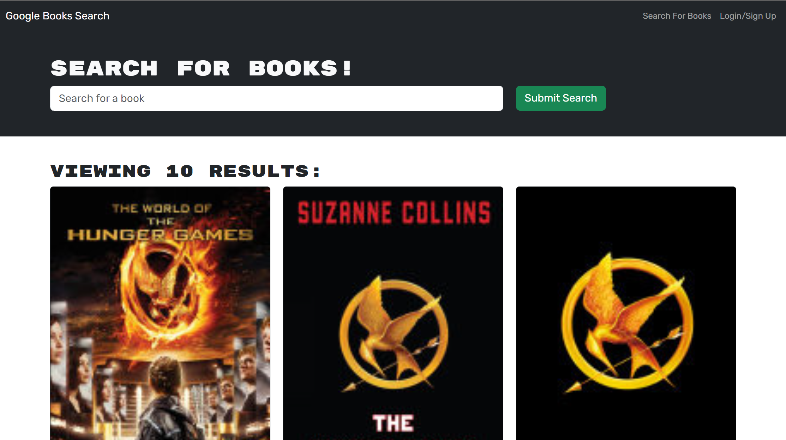

# book-search-engine

## Description

This book search engine allows user to search for any of their favorite books or books they're interesting in. Users are able to saved books to be able to reference later. The search engine is possible with googles book API.

## Functions

- Search for any book

- Signup/Login

- Save books if logged in

- View all saved books if logged in

## Technologies Used

- Apollo Server
- bcrpyt (Hashing passwords)
- Express (Routing)
- Node.js (Backend Javascript Engine)
- GraphQL (API)
- jsonwebtoken (Using tokens)
- mongoose (ODM)
- Bootstrap (CSS framework)
- React (Front End templating)

## Usage 

- You can view the live application with this [link](https://book-search-engine-cx7s.onrender.com/)